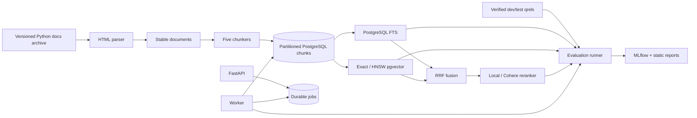

# Architecture and data flow

Documents and chunks use SHA-256-derived IDs. Relevance is authored against source spans and
projected to chunk IDs, avoiding labels that silently change meaning when chunking changes.
The database partitions chunk rows by chunking configuration; every partition has independent
384-dimensional local and 1,536-dimensional hosted HNSW indexes.

All metadata filter column names come from a fixed allowlist and values are bound parameters.
Archive extraction validates every resolved path before writing. Hosted responses are cached
by provider/model and input hash, while secrets remain environment-only.

Long operations are durable jobs. A worker atomically claims one queued record with
`FOR UPDATE SKIP LOCKED`, runs it, and stores a structured result or error. This avoids adding
Redis while remaining safe with multiple worker replicas.

